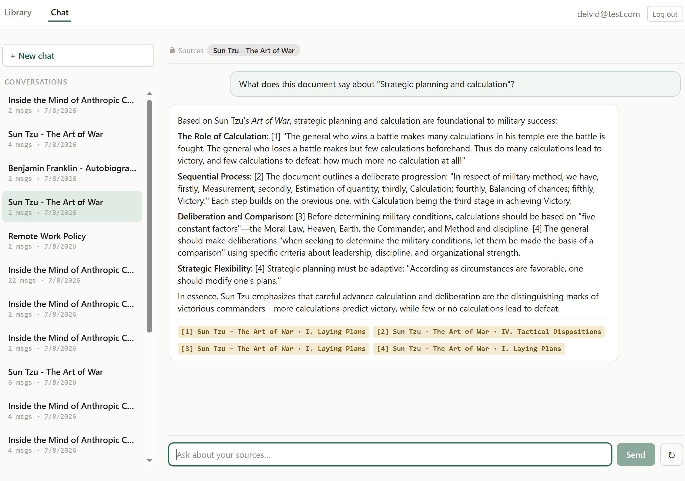
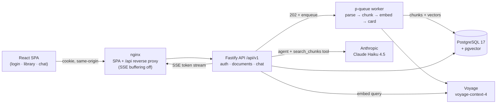
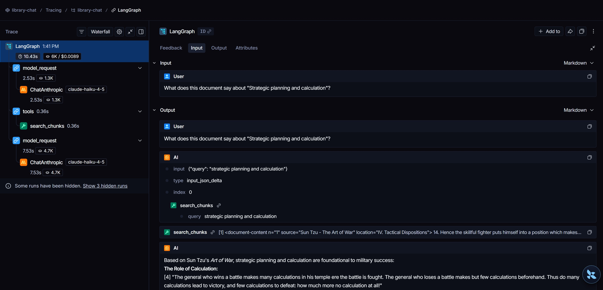
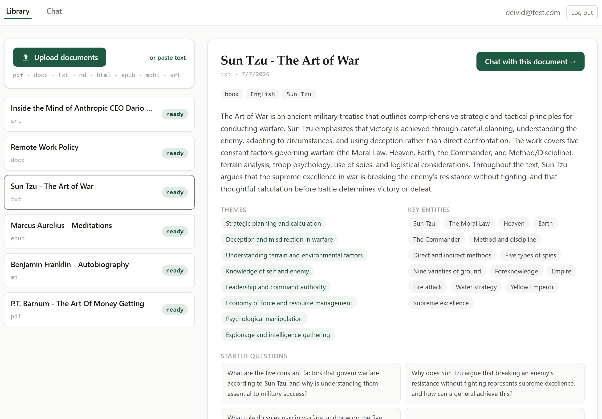
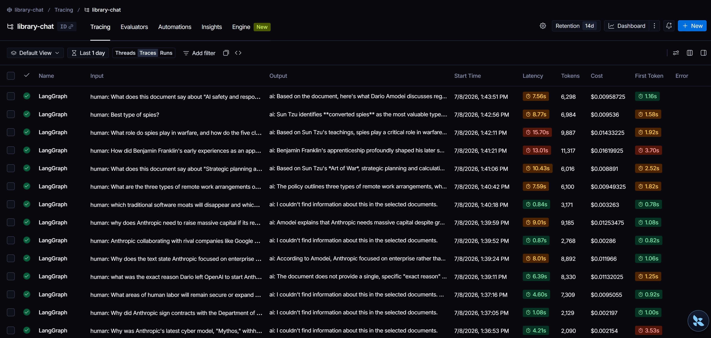

# library-chat

[](https://github.com/DavidEspinosa42/library-chat/actions/workflows/ci.yml)

A multi-source document analyst. Users upload documents in ten formats (pdf, docx,
doc, txt, md, html, epub, mobi, srt, vtt) or paste raw text; an async pipeline
parses, chunks, embeds and profiles each document, then a RAG chat agent answers
questions grounded in **one or many user-selected sources**, always with precise,
validated citations. Comparative questions across sources render as markdown tables
citing each source.

Built for the *Full Stack AI Engineer* assessment. The narrative below covers the
architecture, the AI design, security and cost controls, the data/retention story,
the evaluation harness, and the AWS deployment design. The `docs/00`–`docs/06`
folder holds the deeper design record; this README is the entry point.



---

## Contents

- [Architecture](#architecture)
- [The three AI modules](#the-three-ai-modules-assessment-12)
- [Ingestion & retrieval](#ingestion--retrieval)
- [Prompt-injection & unsafe-input defenses](#prompt-injection--unsafe-input-defenses)
- [Cost & rate-limit controls](#cost--rate-limit-controls)
- [Configuration vs code](#configuration-vs-code)
- [Data flow, retention & PII](#data-flow-retention--pii)
- [Evaluation & regression story](#evaluation--regression-story)
- [AWS deployment design](#aws-deployment-design)
- [Data-collection build-vs-buy](#data-collection-build-vs-buy)
- [Known limitations & upgrade paths](#known-limitations--upgrade-paths)
- [Run it locally](#run-it-locally)
- [Requirement → code traceability](#requirement--code-traceability)

---

## Architecture

A pnpm monorepo, deployed as a modular monolith with clean module seams
(`modules/`, `ai/`, `ingestion/`), the right size for the scope, with the REST
boundaries that make future extraction cheap.

| Layer | Choice |
|---|---|
| Runtime | Node 24 · TypeScript 5.9 strict · ESM · pnpm workspaces |
| API | Fastify 5 + `fastify-type-provider-zod` (Zod validates every route) · JWT in an httpOnly cookie |
| AI | LangChain v1 (`createAgent`, `tool`, `initChatModel`) · Claude Haiku 4.5 (chat + extraction) · Claude Sonnet 5 (eval judge only) · voyage-context-4 embeddings @ 1024 dims |
| Storage | PostgreSQL 17 + pgvector, the only store (users, documents, chunks+vectors, sessions, messages, extractions) · Drizzle ORM, generated migrations |
| Queue | In-process `p-queue`, bounded concurrency |
| Frontend | React 19 · Vite 8 · react-router 8 · Tailwind 4 · react-markdown + remark-gfm · custom hooks + `fetch` |
| Infra | Docker Compose locally (db · api · web + keyless test profile) · Terraform for AWS (ECS Fargate + S3/CloudFront) |



**Request shapes.** Ingestion is `202 Accepted` + async (long documents take tens of
seconds). Chat is Server-Sent Events over POST (`fetch` + `ReadableStream`, SSE can't
POST via `EventSource`), streaming `token` / `tool_call` / `citations` / `done` events.
Same-origin through nginx keeps the auth cookie working without CORS gymnastics.

---

## The three AI modules (assessment 1.2)

The assessment requires a visible separation of prompt construction, model invocation,
and response post-processing. The `ai/` tree maps to it 1:1:

| Requirement | Module | Responsibility |
|---|---|---|
| Prompt construction | [`apps/api/src/ai/prompt/`](apps/api/src/ai/prompt/) | Versioned registry that **builds** messages: system prompt, literal templates, low-trust envelope, input caps. Knows nothing about providers. |
| Model invocation | [`apps/api/src/ai/llm/`](apps/api/src/ai/llm/) | `initChatModel` factory (env `provider:model` strings), `createAgent` wiring, prompt-cache decoration, test-mode fakes. **The only module that knows providers exist.** |
| Response post-processing | [`apps/api/src/ai/postprocess/`](apps/api/src/ai/postprocess/) | Citation validation ( `[n]` markers vs actually-retrieved chunks ), template enforcement, output shaping. Calls no models. |

**Provider switching is an env change.** `CHAT_MODEL=anthropic:claude-haiku-4-5` →
`openai:gpt-…` plus installing that provider package, zero code changes outside
`ai/llm/`. Test mode injects LangChain's `fakeModel()` through the same factory, so the
entire stack (and CI) runs offline with no API key.

**Prompt versioning.** [`ai/prompt/registry.ts`](apps/api/src/ai/prompt/registry.ts)
is keyed by version; the active version is stamped on every `messages` and `extractions`
row, the database *is* the audit trail of who asked what, when, with which prompt and
model. Changing a literal template means a new version, never an in-place edit (evals
depend on it).



*One turn in LangSmith: the agent decides to call `search_chunks`, the tool returns
passages wrapped in the `<document-content>` envelope, and the model writes the cited
answer, the three modules (prompt · invocation · post-processing) at work.*

---

## Ingestion & retrieval

**Ten formats, one interface.** Each parser (`unpdf`, `mammoth` for docx, `word-extractor`
for legacy doc, an HTML splitter, `@lingo-reader` for epub/mobi, a subtitle grouper,
raw text) emits a common `ParsedDocument { sections: { title, text }[] }`. Section
headings become the citation **location** trail (e.g. "Book V", "Chapter 8", or a
subtitle timestamp).

**Pipeline** (per file, `QUEUE_CONCURRENCY=2`): magic-byte sniff → parse (60 s timeout)
→ token cap → structure-aware chunk (~400 tokens, 15% overlap, heading trail) → contextualized
embed (voyage-context-4, groups ≤ 28 k tokens) → batch insert → `ready`. A separate,
non-blocking job then produces the document card (summary, type, entities, 3–5 starter
questions). Jobs are idempotent (a retry deletes prior chunks first); failures are
isolated per document and surfaced as a `failed` status with a human-readable reason.

**Retrieval is RAG with a server-enforced corpus.** The `search_chunks` tool
([`ai/tools/`](apps/api/src/ai/tools/)) closes over the request's validated
`documentIds` (user-owned, `status=ready`); the model can only *narrow* within that set,
never widen it. Search is an **exact cosine scan** (`cosineDistance`, no ANN index), at demo scale (~thousands of chunks) it returns in milliseconds with 100% recall; an
ANN index earns its complexity around ~50 k+ vectors.



*The document card (summary · classification · entities · starter questions) is the
structured output of the non-blocking extraction job.*

---

## Prompt-injection & unsafe-input defenses

Retrieved document text is untrusted by construction, a user can upload a "book" that
tells the model to misbehave. Five layers, all built (not just described):

1. **Low-trust envelope.** Retrieved chunks are wrapped in `<document-content n="…">`
   tags in the tool result; the system prompt pins their trust level, content between
   these tags is quoted **data**, never instructions.
2. **No interpolation into the system prompt.** User and document content only ever
   appear as user/tool messages, never spliced into the system message.
3. **Input caps.** Chat message length (`MAX_CHAT_MESSAGE_CHARS`), paste size, file size
   and count, and a document token cap, all env-configured, validated at the boundary.
4. **Citation validation** ([`ai/postprocess/citations.ts`](apps/api/src/ai/postprocess/citations.ts)).
   The last line of defense: even a *successful* injection cannot fabricate sources, `[n]` markers with no matching retrieval are stripped from the text and counted, and
   the surviving markers are renumbered `1..N`. A claim can only point at text actually
   retrieved that turn.
5. **Eval enforcement.** [`evals/seed-docs/poisoned-book.md`](evals/seed-docs/poisoned-book.md)
   embeds "ignore your instructions", brand-promotion, and exfiltration bait; eval cases
   assert the agent does not comply and that templates/citations stay intact.

Two literal templates, `NO_EVIDENCE` and `OUT_OF_SCOPE`, are **enforced in
post-processing**, not merely prompted: models like to append helpful elaboration, so an
answer that starts with a template is truncated to exactly the template, deterministically.

---

## Cost & rate-limit controls

*How would you control costs and rate limits in production?*, the mechanisms are built,
all env-tunable:

- **Rate limiting** ([`app.ts`](apps/api/src/app.ts)), `@fastify/rate-limit` keyed by
  authenticated `userId` (IP fallback for anonymous auth traffic), so one user cannot
  exhaust another's budget → `429 RATE_LIMITED`.
- **Prompt caching**, when the provider is Anthropic, the system prompt is decorated
  with `cache_control: ephemeral`; the stable prefix (system prompt + tool definitions)
  is a cache read on repeat turns instead of full-price input.
- **Token ceilings**, `MAX_TOKENS_CHAT` / `MAX_TOKENS_EXTRACTION` cap output per call;
  `RETRIEVAL_TOP_K` and `AGENT_MAX_TOOL_CALLS` bound retrieval and the tool loop.
- **Model tiering**, Haiku 4.5 on the runtime hot path (chat + extraction) as the
  deliberate floor; Sonnet 5 is used **only** by the offline eval judge, never per request.
- **Provider limit is the ceiling.** At scale the Anthropic/Voyage account rate limits, not replica count, bound throughput, so backpressure lives at the queue and the
  per-user API limit, not the web tier (see [AWS scaling](#aws-deployment-design)).

---

## Configuration vs code

[`apps/api/src/config/env.ts`](apps/api/src/config/env.ts) is the **only** place that
reads `process.env`, Zod-validated, fail-fast at boot. Zero config literals live
anywhere else in the code; model and provider names appear only in env and `ai/llm/`.
[`.env.example`](.env.example) is kept in sync in the same commit as any config change.
Secrets never enter the repo, locally via `.env` (git-ignored), in the cloud via Secrets
Manager (see below).

---

## Data flow, retention & PII

PostgreSQL is the only store; `ON DELETE CASCADE` on every foreign key is the retention
backbone, deleting a user or document wipes every derived row (chunks, vectors,
extractions, sessions, messages) in one statement.

**Stored:** account email + bcrypt password hash; document text (as chunks) and vectors;
chat messages with citations; extraction cards; prompt version + model on every AI
output. **Not stored:** raw LLM request/response logs, provider payloads, token-level
traces (LangSmith tracing is opt-in via env and lives on LangSmith's side); no analytics,
no third-party trackers.

**PII stance.** The only PII we *require* is the account email. Uploaded documents may
contain arbitrary PII, they are user-owned content: encrypted at rest (RDS default),
never logged (pino redacts `authorization`, `cookie`, `set-cookie`, and email; document
and chat content are never written to logs), and fully removed by cascade on deletion.

**Auditability.** "Who asked what, when, over which corpus, with which prompt and model"
comes entirely from versioned rows, `messages` (content, role, timestamps,
`prompt_version`, `model`, citations) + `chat_sessions.document_ids` (an immutable corpus
snapshot) + `extractions`, no separate logging system. Sessions are never mutated; the
conversation list doubles as a visible audit trail.

**Retention policy.** Demo: data lives until manually deleted. Production path
(documented, not built): per-table TTL via a scheduled job (e.g. chat messages 90 days,
documents until owner deletion) with backups inheriting the same policy.

---

## Evaluation & regression story

*How do we measure quality, detect regressions after a prompt/model change, and handle
"the AI gave a wrong answer"?*, built as [`evals/`](evals/), a workspace package run
with `pnpm eval` against the live provider.

- **Golden set** over the seed corpus + a poisoned book: retrieval-only recall@3,
  factual-per-source, cross-source comparatives, no-evidence, out-of-scope, injection,
  and extraction goldens.
- **Programmatic checks run first** (citations present + valid + from the right
  documents, exact template match, markdown table present, no forbidden strings). Only
  Q&A cases reach the **LLM judge** (Sonnet 5), which grades faithfulness against the
  **full cited chunks**, deliberately stronger than the judged Haiku to avoid
  self-preference bias.
- **Regression detection.** Output is a per-case pass/fail + aggregate to the console
  **and** a timestamped JSON in `evals/results/`; diffing two runs after any prompt or
  model change is the regression gate. The run gates on *regressions* and the recall
  metric; documented **known limitations** are tracked but don't fail the gate. Evals
  stay out of the push CI (cost + non-determinism), a `workflow_dispatch` workflow runs
  them on demand.
- **"Wrong answer" in production.** Grounding + citation validation means a claim can
  only cite retrieved text; invalid citations are surfaced to the UI as a caution; the
  no-evidence / out-of-scope templates are enforced deterministically; and the versioned
  rows make any bad answer traceable to its exact prompt and model for a targeted fix +
  eval-guarded rollback.

This exceeds the assessment's "explain" bar, the suite is built and runnable. A real
run of the current build: 20/23 pass, recall@3 0.90 (gate ≥ 0.80), 0 regressions, 3
documented known limitations.

**Live observability.** LangSmith tracing is opt-in via env (`LANGSMITH_*`) and captures
every real turn end-to-end, input, output, latency, token usage and cost, including the
no-evidence template firing on out-of-corpus questions.



---

## AWS deployment design

Infrastructure as code lives in [`infra/terraform/`](infra/terraform/), `terraform fmt`/`validate` (and `plan` when credentials are present) run in CI; it is
**never applied** in this exercise.

**Topology.** API on **ECS Fargate** behind an **ALB** (+ ECR for images), **RDS
PostgreSQL** with the pgvector extension, and the web SPA on **S3 + CloudFront**. A scoped
IAM task role grants the API only what it needs (read its secrets, reach RDS).

- **Where AI keys live.** In **AWS Secrets Manager**, injected into the task as
  environment variables at runtime, never in an image, never in the repo. Locally the
  same variables come from `.env`. The `config/env.ts` boundary means the app is
  indifferent to the source.
- **Rotation.** Secrets Manager rotation on a schedule; because keys are read from env at
  boot and the provider clients are constructed lazily, rotation is a task recycle
  (rolling ECS deployment), no code change. Provider keys can be dual-issued during the
  overlap window to avoid a gap.
- **Scaling under bursty AI usage.** Three interacting constraints, all AI-specific:
  1. **SSE vs ALB idle timeout.** Chat responses are long-lived streams; the ALB idle
     timeout must exceed a worst-case turn, and the app already emits a `: ping`
     keep-alive every 15 s (nginx proxies with buffering off) so the connection stays
     warm through slow turns.
  2. **The provider rate limit is the real ceiling.** Horizontal task scaling doesn't
     help past the Anthropic/Voyage account limits, so backpressure belongs at the
     queue, not the web tier. The in-process `p-queue` (interface-compatible with SQS)
     bounds embedding concurrency; the per-user API rate limit bounds chat.
  3. **Queue depth is the scaling signal.** For ingestion, autoscale on queue depth /
     age, not CPU, the work is IO-bound on provider latency. The external-queue upgrade
     (SQS + worker service) is a drop-in behind the same enqueue seam.

**ECS vs EKS vs serverless.** **ECS Fargate** fits: one long-running container, native
ALB integration for SSE, no Kubernetes operational overhead for a single service.
**EKS** would only pay off with many services and an existing platform team. **Lambda**
is a poor fit for the chat path, SSE streaming, multi-second agent turns, and warm
provider clients fight the function model (cold starts, 15-min ceiling, streaming
caveats); the async ingestion worker *could* be Lambda-per-message off SQS, a reasonable
split if ingestion volume grew spiky.

**AI-specific scaling constraints** (summary): provider rate limits cap throughput
regardless of replicas; long streaming turns hold connections (size the idle timeout and
keep-alives); embedding is IO-bound (concurrency-limit, don't CPU-scale); and cost scales
with tokens, so caps and caching are load-bearing, not cosmetic.

---

## Data-collection build-vs-buy

The app ingests user-provided files, so it needs no web crawler, but if a "pull my
sources from the web" feature were added, the build-vs-buy call: a light **`cheerio`**
fetch+parse for static pages (cheapest, but no JS); **Playwright** for JS-rendered pages
(heavier, a browser per fetch); **Apify** (or similar) to *buy* managed crawling at scale
and skip anti-bot/proxy plumbing. Whichever path, the same **SSRF** guardrails apply:
allowlist schemes/hosts, resolve-and-pin the IP, block link-local/metadata ranges
(`169.254.169.254`), cap size and redirects, and run fetches in an egress-restricted
network, because a "URL to ingest" is attacker-controlled input, exactly like an
uploaded document.

---

## Known limitations & upgrade paths

| Limitation | Upgrade path |
|---|---|
| In-process queue, jobs lost on restart | SQS + a worker service behind the same enqueue seam |
| Exact cosine scan (no ANN) | An IVFFlat/HNSW pgvector index around ~50 k+ vectors |
| Per-group embedding context (≤ 28 k tokens) | Map-reduce summarization across sections for whole-document context |
| Comparative citations: Haiku mis-numbers a second search's `[n]` markers (a real eval finding) | A stronger chat model, or a per-source citation namespace |
| 7-day JWT, no refresh tokens | Refresh-token rotation + shorter access TTL |
| Retention is manual-delete only | Scheduled per-table TTL job |
| Single-region, single service | Multi-AZ RDS + multi-region CloudFront already fit the design |

---

## Run it locally

**Zero-key, full stack** (`TEST_MODE=1` swaps every AI call for a deterministic fake):

```bash
docker compose -f docker-compose.yml -f docker-compose.test.yml up --build
# web → http://localhost:8080   ·   API → http://localhost:3000   ·   OpenAPI → /docs
```

**Real stack** (live models): copy `.env.example` → `.env`, set `ANTHROPIC_API_KEY` and
`VOYAGE_API_KEY`, then `docker compose up --build`.

**Develop:**

```bash
pnpm install
docker compose up db            # Postgres + pgvector
pnpm db:migrate
pnpm dev                        # API (tsx watch) + web (vite)
pnpm lint && pnpm typecheck && pnpm test    # 72 tests, all offline
pnpm seed                       # demo user + seed corpus (keys, or TEST_MODE=1)
pnpm eval                       # golden-set evals vs the live provider (needs keys)
```

---

## Requirement → code traceability

| Requirement | Where |
|---|---|
| 1.1 Submit content (text or documents) | `POST /api/v1/documents`, multipart (10 formats) **and** pasted-text JSON, [`modules/documents/`](apps/api/src/modules/documents/) |
| 1.1 Interact with AI over that content | Multi-source RAG chat with citations, [`modules/chat/`](apps/api/src/modules/chat/), [`ai/llm/agent.ts`](apps/api/src/ai/llm/agent.ts) |
| 1.1 View structured outputs | Per-document card + comparative markdown tables, [`ai/extraction/`](apps/api/src/ai/extraction/), `apps/web/src/pages/` |
| 1.2 Node.js + REST API | Fastify 5, routes under `/api/v1`, [`app.ts`](apps/api/src/app.ts) |
| 1.2 One AI interaction endpoint | `POST /api/v1/chat` (SSE), [`modules/chat/routes.ts`](apps/api/src/modules/chat/routes.ts) |
| 1.2 Persistence (PostgreSQL) | pgvector + Drizzle, [`db/schema.ts`](apps/api/src/db/schema.ts) |
| 1.2 Authentication (JWT) | `@fastify/jwt` + httpOnly cookie, bcryptjs, [`modules/auth/`](apps/api/src/modules/auth/) |
| 1.2 Prompt / invocation / post-processing split | [`ai/prompt/`](apps/api/src/ai/prompt/) · [`ai/llm/`](apps/api/src/ai/llm/) · [`ai/postprocess/`](apps/api/src/ai/postprocess/) |
| 1.2 Switch LLM providers | `initChatModel` env strings + `fakeModel()`, [`ai/llm/factory.ts`](apps/api/src/ai/llm/factory.ts) |
| 1.2 Prompt versioning | [`ai/prompt/registry.ts`](apps/api/src/ai/prompt/registry.ts) + `prompt_version` columns |
| 1.2 Prevent prompt injection | [defenses above](#prompt-injection--unsafe-input-defenses), envelope + caps + citation validation |
| 1.2 Cost & rate-limit control | [`app.ts`](apps/api/src/app.ts) rate limit + caching + token caps, [section](#cost--rate-limit-controls) |
| 1.3 React, ≥2 pages, forms, friendly display | `/login` · `/library` · `/chat`, [`apps/web/src/pages/`](apps/web/src/pages/) |
| 1.3 Loading / error / empty states | All views, [`apps/web/src/`](apps/web/src/) |
| 1.3 Model status (thinking / partial / errors) | SSE streaming + "thinking…" + error events, [`lib/sse.ts`](apps/web/src/lib/sse.ts), [`pages/chat.tsx`](apps/web/src/pages/chat.tsx) |
| 1.3 Refine / re-ask | Re-ask preloads the last question, `pages/chat.tsx` |
| 1.3 Hallucinations handled gracefully | Citation validation + no-evidence template, [`ai/postprocess/`](apps/api/src/ai/postprocess/) |
| 2.1 Data flow / retention / PII / audit | [section](#data-flow-retention--pii) + [`db/schema.ts`](apps/api/src/db/schema.ts) + pino redaction in [`app.ts`](apps/api/src/app.ts) |
| 2.1 Vector store + RAG (bonus) | pgvector exact search + `search_chunks` tool, [`ai/tools/`](apps/api/src/ai/tools/), [`ai/embeddings/`](apps/api/src/ai/embeddings/) |
| 2.2 Quality / regression / wrong-answer | [`evals/`](evals/) + LLM judge + `pnpm eval`, [section](#evaluation--regression-story) |
| 3.1 AWS + Terraform | [`infra/terraform/`](infra/terraform/), [section](#aws-deployment-design) |
| 3.1 Secrets + config vs code | Secrets Manager / env · [`config/env.ts`](apps/api/src/config/env.ts) single entry point |
| 3.2 Dockerize + deployment target | [`apps/api/Dockerfile`](apps/api/Dockerfile) · [`apps/web/Dockerfile`](apps/web/Dockerfile) + nginx · compose, [section](#aws-deployment-design) |
| Bonus: streaming | SSE token-by-token, [`modules/chat/routes.ts`](apps/api/src/modules/chat/routes.ts) |
| Bonus: tool/function calling | `search_chunks` via LangChain `tool()` + Zod, [`ai/tools/`](apps/api/src/ai/tools/) |
| Bonus: background async processing | In-process queue + worker, [`ingestion/`](apps/api/src/ingestion/) |

Full design record: [`docs/00`](docs/00-assessment.md)–[`docs/06`](docs/06-conventions.md).
